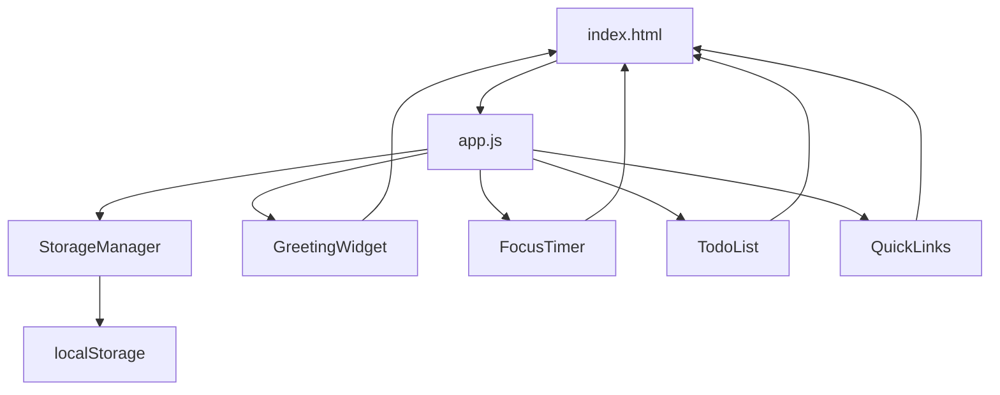
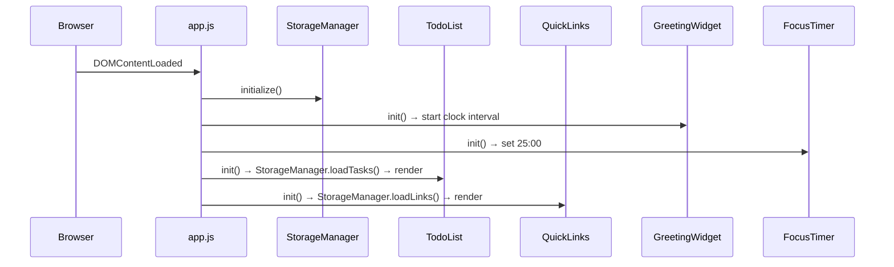
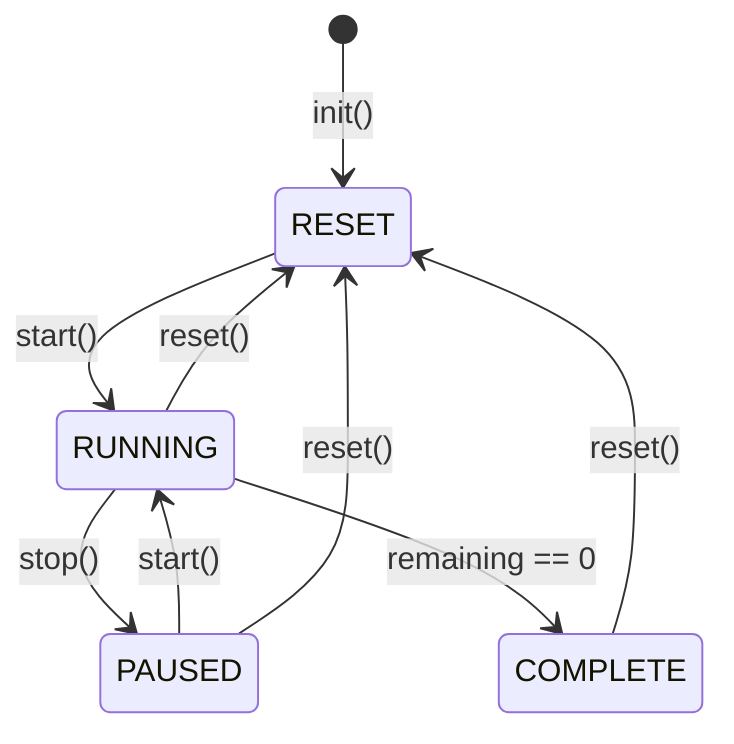

# Design Document: To-Do Life Dashboard

## Overview

The To-Do Life Dashboard is a self-contained, browser-based personal productivity homepage. It is built with plain HTML, CSS, and Vanilla JavaScript with zero runtime dependencies, frameworks, or external network requests. All data is persisted client-side via the browser's `localStorage` API.

The application is a single HTML page composed of four independent widgets:

1. **Greeting Widget** — real-time clock, date, and time-of-day greeting
2. **Focus Timer** — 25-minute Pomodoro-style countdown
3. **Todo List** — task management with add/edit/complete/delete
4. **Quick Links** — user-defined shortcut buttons to external URLs

The design goals are simplicity, correctness, and long-term maintainability. Each widget is fully self-contained: it owns its DOM subtree, its event listeners, and its slice of localStorage. Widgets communicate only through the shared `StorageManager` module.

---

## Architecture

The application follows a **module-per-widget** architecture with a central storage abstraction layer.

```
index.html
├── css/
│   └── style.css          (all styles, single file)
└── js/
    └── app.js             (all logic, single file)
```

Since the requirement mandates a single JavaScript file (`js/app.js`), all modules are implemented as immediately-invoked function expressions (IIFEs) or plain objects acting as namespaces, avoiding the need for a build step while still providing logical separation.

### High-Level Module Diagram



### Initialization Flow



---

## Components and Interfaces

### StorageManager

Central read/write abstraction for `localStorage`. All persistence operations go through this module. No widget touches `localStorage` directly.

```js
const StorageManager = {
  KEYS: {
    TASKS: 'tdl_tasks',
    LINKS: 'tdl_links'
  },
  saveTasks(tasks: Task[]): void,
  loadTasks(): Task[],
  saveLinks(links: Link[]): void,
  loadLinks(): Link[]
}
```

- `saveTasks` / `saveLinks`: serialize the array to JSON via `JSON.stringify` and call `localStorage.setItem`.
- `loadTasks` / `loadLinks`: call `localStorage.getItem`, parse with `JSON.parse` inside a `try/catch`, return the result if it is an array, or return `[]` on any failure.
- Distinct keys (`tdl_tasks`, `tdl_links`) prevent key collisions.

### GreetingWidget

Owns the greeting/clock section of the DOM. Uses `setInterval` to update every second.

```js
const GreetingWidget = {
  init(): void,                     // starts the 1-second interval
  _tick(): void,                    // called every second
  formatTime(date: Date): string,   // returns "HH:MM:SS"
  formatDate(date: Date): string,   // returns "Weekday, Month D, YYYY"
  getGreeting(hour: number): string // returns greeting string
}
```

Key behaviors:
- `formatTime` pads hours, minutes, and seconds with leading zeros.
- `getGreeting` maps the hour to one of the four greeting strings using boundary comparisons.
- If `new Date()` throws (unavailable clock), the widget falls back to `"Welcome"` and `"--:--:--"`.

### FocusTimer

Owns the timer DOM section. Uses a single `setInterval` reference for the countdown.

```js
const FocusTimer = {
  INITIAL_SECONDS: 1500,  // 25 * 60
  remaining: number,      // seconds remaining
  intervalId: number|null,
  init(): void,
  start(): void,
  stop(): void,
  reset(): void,
  _tick(): void,          // decrements remaining, updates display
  formatTime(seconds: number): string, // returns "MM:SS"
  _updateUI(): void       // syncs DOM to internal state
}
```

State machine:



Control availability:

| State    | Start | Stop | Reset |
|----------|-------|------|-------|
| RESET    | ✅    | ❌   | ✅    |
| RUNNING  | ❌    | ✅   | ✅    |
| PAUSED   | ✅    | ❌   | ✅    |
| COMPLETE | ❌    | ❌   | ✅    |

### TodoList

Manages a stateful array of `Task` objects in memory. Persists via `StorageManager` on every mutation.

```js
const TodoList = {
  tasks: Task[],
  init(): void,
  addTask(label: string): void,
  toggleTask(id: string): void,
  editTask(id: string, newLabel: string): void,
  deleteTask(id: string): void,
  _render(): void,
  _save(): void       // calls StorageManager.saveTasks(this.tasks)
}
```

Validation rules:
- `label.trim()` must be non-empty to add or save an edit. If blank, a validation message is shown and the input retains focus.

### QuickLinks

Manages a stateful array of `Link` objects. Same persistence pattern as `TodoList`.

```js
const QuickLinks = {
  links: Link[],
  init(): void,
  addLink(label: string, url: string): void,
  deleteLink(id: string): void,
  _render(): void,
  _save(): void       // calls StorageManager.saveLinks(this.links)
}
```

URL validation: The URL must start with `"http://"` or `"https://"` (case-insensitive prefix check). Label is max 50 characters; URL is max 2048 characters (enforced via `maxlength` HTML attribute and validated before submission).

---

## Data Models

### Task

```js
{
  id: string,          // crypto.randomUUID() or Date.now().toString()
  label: string,       // trimmed, non-empty task text
  completed: boolean   // false by default
}
```

Stored under localStorage key `tdl_tasks` as a JSON array.

### Link

```js
{
  id: string,          // unique identifier
  label: string,       // max 50 characters, trimmed
  url: string          // must start with http:// or https://, max 2048 chars
}
```

Stored under localStorage key `tdl_links` as a JSON array.

### Storage Schema

```js
// localStorage["tdl_tasks"]
[
  { "id": "1721000000000", "label": "Write report", "completed": false },
  { "id": "1721000001000", "label": "Review PR", "completed": true }
]

// localStorage["tdl_links"]
[
  { "id": "1721000002000", "label": "GitHub", "url": "https://github.com" }
]
```

---

## Correctness Properties

*A property is a characteristic or behavior that should hold true across all valid executions of a system — essentially, a formal statement about what the system should do. Properties serve as the bridge between human-readable specifications and machine-verifiable correctness guarantees.*

### Property 1: Time formatting is always valid HH:MM:SS

*For any* `Date` object, `GreetingWidget.formatTime(date)` SHALL return a string matching the pattern `HH:MM:SS` where HH is in [00..23], MM is in [00..59], and SS is in [00..59].

**Validates: Requirements 1.1**

---

### Property 2: Greeting mapping covers all hours

*For any* integer hour in [0..23], `GreetingWidget.getGreeting(hour)` SHALL return exactly one of `"Good Morning"`, `"Good Afternoon"`, `"Good Evening"`, or `"Good Night"`, with no hour returning an unexpected or empty string.

**Validates: Requirements 1.3, 1.4, 1.5, 1.6**

---

### Property 3: Timer MM:SS format is always valid

*For any* integer seconds value in [0..1500], `FocusTimer.formatTime(seconds)` SHALL return a string matching the pattern `MM:SS` where MM is in [00..25] and SS is in [00..59].

**Validates: Requirements 2.3**

---

### Property 4: Timer reset always restores initial state

*For any* timer state (running, paused, or completed, with any remaining time in [0..1500]), calling `reset()` SHALL set remaining time back to 1500 seconds and display `"25:00"`.

**Validates: Requirements 2.6**

---

### Property 5: Adding any valid task grows the list by exactly one

*For any* task list of any length, and any non-empty, non-whitespace-only string label, calling `addTask(label)` SHALL increase the task list length by exactly 1, and the new task with that label SHALL be present in the list.

**Validates: Requirements 3.2**

---

### Property 6: Whitespace-only labels are always rejected

*For any* string composed entirely of whitespace characters (spaces, tabs, newlines), attempting to add it as a task or save it as an edit SHALL leave the task list unchanged and SHALL not add or modify any task.

**Validates: Requirements 3.3, 3.7**

---

### Property 7: Task completion toggle is its own inverse

*For any* task with any completion state, toggling it twice SHALL return the task to its original completion state. Toggling once SHALL flip the state.

**Validates: Requirements 3.4**

---

### Property 8: Deleting a task removes it completely

*For any* task list containing at least one task, deleting a task by its ID SHALL result in a list that (a) no longer contains that task ID, and (b) has a length exactly one less than before the deletion.

**Validates: Requirements 3.8**

---

### Property 9: Task persistence round-trip

*For any* array of valid `Task` objects, calling `StorageManager.saveTasks(tasks)` followed by `StorageManager.loadTasks()` SHALL return an array structurally identical to the original (same IDs, labels, and completion states, in the same order).

**Validates: Requirements 3.10, 5.1, 5.2**

---

### Property 10: Adding any valid link grows the panel by exactly one

*For any* links list of any length, and any non-empty label + URL beginning with `"http://"` or `"https://"`, calling `addLink(label, url)` SHALL increase the links list length by exactly 1 and the new link SHALL be present.

**Validates: Requirements 4.4**

---

### Property 11: Invalid URLs are always rejected

*For any* string that does not begin with `"http://"` or `"https://"` (including empty strings, plain domain names, and `ftp://` URLs), attempting to add it as a link URL SHALL leave the links list unchanged.

**Validates: Requirements 4.5**

---

### Property 12: Link persistence round-trip

*For any* array of valid `Link` objects, calling `StorageManager.saveLinks(links)` followed by `StorageManager.loadLinks()` SHALL return an array structurally identical to the original (same IDs, labels, and URLs, in the same order).

**Validates: Requirements 4.9, 5.1, 5.2**

---

### Property 13: Corrupt storage always falls back to empty array

*For any* malformed value in localStorage (null, undefined, non-JSON string, JSON non-array such as a number, boolean, or object), both `StorageManager.loadTasks()` and `StorageManager.loadLinks()` SHALL return an empty array `[]` without throwing an exception.

**Validates: Requirements 4.10, 5.3, 5.4, 5.5, 5.6**

---

## Error Handling

### Storage Failures

All `localStorage` reads are wrapped in `try/catch`. If parsing fails for any reason, the affected list is initialized to `[]`. The UI renders an empty state rather than an error message. Write failures (e.g., storage quota exceeded) are caught silently; the in-memory state remains valid even if the write did not persist.

### Clock Unavailability

If `new Date()` returns an invalid date (e.g., `isNaN(date.getTime())`), `GreetingWidget` falls back to displaying `"Welcome"` and `"--:--:--"` rather than crashing.

### Invalid Task / Link Input

Validation occurs in the widget layer before any data reaches `StorageManager`. Empty or whitespace-only labels show an inline validation message and retain input focus. Invalid URLs show a field-specific validation message.

### Timer Edge Cases

The `_tick` handler clears the interval before decrementing to zero to avoid multiple firings. The `reset` function always clears the `intervalId` with `clearInterval` regardless of current state.

---

## Testing Strategy

### Approach

The project uses a **dual testing strategy**:

- **Unit / property-based tests** for pure logic functions (`StorageManager`, format functions, validation predicates, `FocusTimer` state machine).
- **Integration / example-based tests** for widget init/render cycles and localStorage interaction with mocks.
- **Manual / visual smoke tests** for CSS layout, responsive breakpoints, and external network absence.

### Property-Based Testing

The feature has several pure functions and stateful modules that are highly amenable to property-based testing. The recommended library is **[fast-check](https://github.com/dubzzz/fast-check)** for JavaScript, or equivalently **[jest-fast-check](https://github.com/dubzzz/fast-check/tree/main/packages/jest-fast-check)** for Jest integration.

Each property test is configured to run a **minimum of 100 iterations**.

Each test is tagged with a comment in this format:
`// Feature: todo-life-dashboard, Property N: <property summary>`

**Mapping of properties to tests:**

| Property | Description | Test Pattern |
|----------|-------------|--------------|
| 1 | Time HH:MM:SS format | `fc.date()` → `formatTime` → regex check |
| 2 | Greeting covers all hours | `fc.integer({min:0, max:23})` → `getGreeting` → one of 4 strings |
| 3 | Timer MM:SS format | `fc.integer({min:0, max:1500})` → `formatTime` → regex check |
| 4 | Reset always restores 25:00 | `fc.integer({min:0, max:1500})` as remaining + random state → `reset()` → 1500 |
| 5 | Valid task addition | `fc.string({minLength:1}).filter(s => s.trim().length > 0)` → `addTask` → length+1 |
| 6 | Whitespace rejection | `fc.stringOf(fc.constantFrom(' ','\t','\n'))` → `addTask` → list unchanged |
| 7 | Toggle is own inverse | `fc.boolean()` as initial state → double-toggle → same state |
| 8 | Delete removes task | `fc.array(taskArbitrary, {minLength:1})` → delete one → gone |
| 9 | Task persistence round-trip | `fc.array(taskArbitrary)` → save → load → deep equal |
| 10 | Valid link addition | valid label + `http(s)://` URL arbitrary → `addLink` → length+1 |
| 11 | Invalid URL rejection | URLs without http/https prefix → `addLink` → list unchanged |
| 12 | Link persistence round-trip | `fc.array(linkArbitrary)` → save → load → deep equal |
| 13 | Corrupt storage → empty array | malformed values → load → `[]`, no throw |

### Unit / Example-Based Tests

- Timer initial state (25:00 on init)
- Start → pause → resume sequence
- Timer completion at 00:00 (completion message, disabled controls)
- Edit mode pre-fills input with current label
- Link opens in new tab (mock `window.open`)
- Distinct localStorage keys for tasks vs. links
- Validation messages shown for specific invalid inputs

### Smoke / Manual Tests

- Responsive layout: viewport ≥ 768px shows multi-column grid; < 768px shows single column
- No external network requests on page load (DevTools Network audit)
- Single `css/style.css` and single `js/app.js` files present
- Uniform spacing and typeface visually correct

### Test Setup Notes

Since all code runs in a single `app.js` file, tests should extract pure functions into testable units. A recommended approach is to wrap each module as a factory function that accepts injectable dependencies (e.g., a `storage` parameter instead of calling `localStorage` directly), enabling clean mocking in tests without modifying production code structure.
